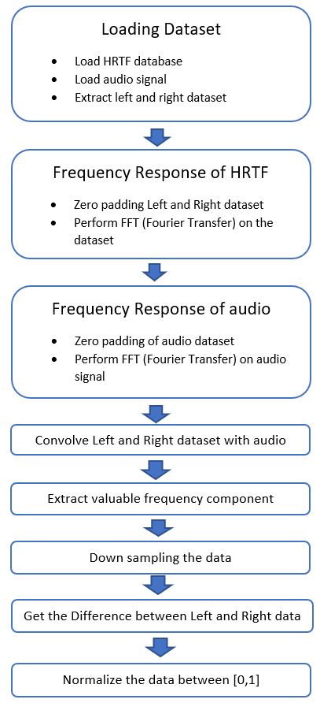
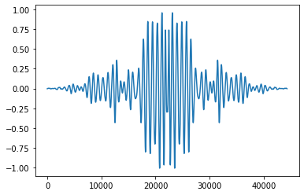
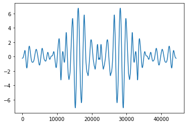
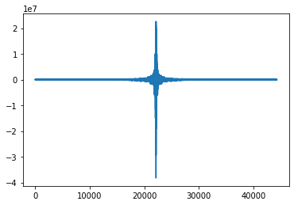
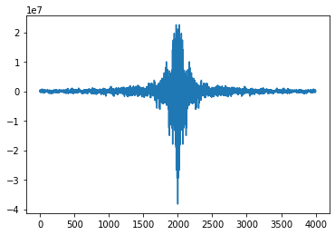
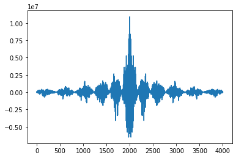
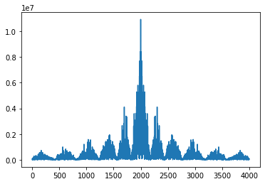
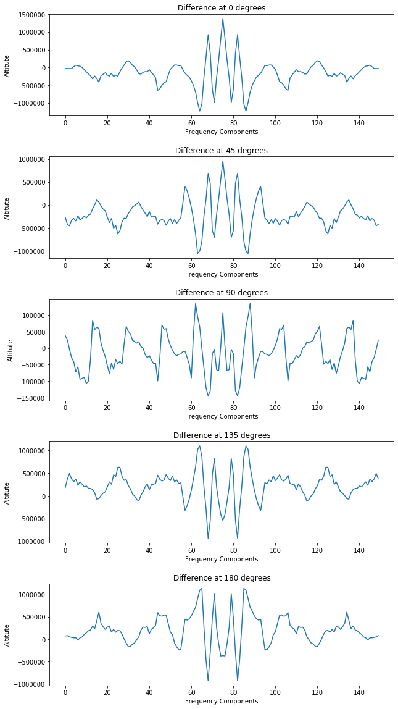
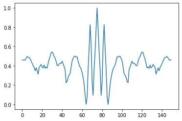
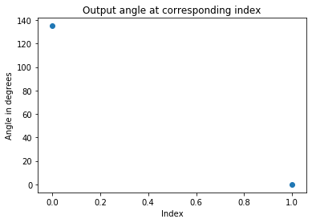

# Audio Localization System
The idea behind this project is that **“to know the direction of sound by taking the difference of left and right ear’s sound frequencies.”**

## Table of contents
* [General info](#general-info)
* [Project Details](#project-details)
  * [Datasets (Training and Testing)](#reducing-the-image-size)
    * [Extraction of valuable data](#extraction-of-valuable-data)
    * [Convolution](#convolution)
    * [Downsampling](#downsampling)
    * [Training the data](#training-the-data)
    * [Know the direction](#know-the-direction)
    * [Normalization](#normalization)
  * [Training the model](#training-the-model)
  * [Testing the data](#testing-the-data)
* [References](#references)

### General info
It has been proved that the sound at each ear is perceived differently if the object is not directly Infront or back of our head.
This happen because Sound waves from a stimulus in a free space are acoustically filtered by the complex structure of our ear before it is being encoded by the auditory nervous system.
The result can be seen in frequency domain of the signal boosting some frequencies for one ear while boosting other of another.
To take advantage of this understanding, many techniques are used to create 3D sound. These filtering techniques are called head related transfer function (HRTFs). 

<h1 align="center">

</h1>

Instead of getting data physically, the use of HRTF data provides better result.
This is done by convolving the audio signal with HRTF to get filtered audio signal for both ears.
Which further will help to build a working prototype of the model without errors rather than having a noisy signal as input.
In the figure above, it is shown the a HRTF (i.e. hL(t) and hR(t)) if convolved with audio give different output audio signals for both ears.

The idea behind this project is that “to know the direction of sound by taking the difference of left and right ear’s sound frequencies.”

Classification method is used to train model using MLP (Multi-layer Perceptron) by Back Propagation.

# Project Details

##	Datasets (Training and Testing)

Since we are creating training and testing data for our model, in this section we are going to describe how did we do it. First, we took the audio and HRTF data file. HRTF data contains left and right, which represents the HRTF data contained for left ear and right ear respectively.

The flow chart below shows the process of creating datasets for training and testing:

<h1 align="center">

</h1>

To understand how we are Pre-processing the data, we have added a section of “Understanding the data and pre-processing”. Our database for the HRTR LEFT and HRTR RIGHT has 200×72 matrix form. The 72 columns, which is taken for 360 degrees at a difference of 5 degrees (i.e. 0, 5, 10, ..., 355).
The diagram below shows the index number corresponded the angle we are going to implement,

<h1 align="center">

</h1>

For example, Index 16 takes the data for angle=10 degrees

The audio signal is sampled at 44100 Hz. We are taking signal of 1 Second length.
To perform the convolution and not to lose any data during that process, we will zero pad the signal.

Since in frequency domain for convolving two signal we simply multiply both signals, so it is required to have both signal of same length, we are zero padding the mat file and audio signal.
Both the signals will be of size = mat data size + audio signal size.

After zero padding, by using fast fourier transfer, we got the frequency response of both HRTF data and audio data.

This is the visualization of left data in Frequency Domain:

<h1 align="center">

</h1>

Similarly, frequency representation of Right data is as follow:

<h1 align="center">

</h1>
 
After we have visualization of left and right data. Now we are going to frequency domain visualization of our audio signal, which is as follow:
 
<h1 align="center">

</h1>

### Extraction of valuable data
As we can see from the above representation, the frequency components dominate in the middle region.
So, these are the frequency components/features of interest.
Here we are taking 4000 samples concentrated at the middle, which represent all the high frequencies. 
By considering only the middle part, we get the following

<h1 align="center">

</h1>

### Convolution
Now we have frequency domain representation of left and right ear’s datasets and also of the audio signal.
So, we did convolution of those signals and the result for left ear audio signal in frequency domain is as follow:

<h1 align="center">

</h1>

Since, the audio signal oscillates in positive and negative values, both having the similar altitude.
We absolutely mod the signal to get all the values in positive.

The signal now looks like:

<h1 align="center">

</h1>
 
### Downsampling

To smoothen the signal and reduce the number of inputs for our model, we down sampled the signal.
 
<h1 align="center">

</h1>

Here Blue line is the audio signal's frequency domain representation of what frequencies a human ear precept on the Left ear when the sound source is on left side.
In the contrast, the Red is frequency domain representation for Right ear.

### Training the data
In the mat file, the data is given for the front source at column index 0
We are going train out MLP model on 0, 45, 90, 135 and 180 degrees starting from left side. As shown in the diagram below:
 
<h1 align="center">

</h1>

### Know the direction
The difference between the left and right ear at different directions is shown below
 
<h1 align="center">

</h1>

Finally, to know the direction from which the sound is coming from we will take difference between the sound received from left ear and right ear.
And this difference we will measure at different degrees.

### Normalization
To train the model without any error, we are normalizing the data between [0,1].The output we get is as follow;

<h1 align="center">

</h1>

## Training the model
 
The normalized data is our input data to the model.
Here we are using Multi-layer Perceptron to train our model by Back Propagation.

## Testing the data

While testing the model, we used different audio. And it gave us the correct results as:
 
<h1 align="center">

</h1>

Angle at index [0] is 135 degrees
Angle at index [1] is 0 degrees

## References
1.	An Integrated Approach of 3D Sound Rendering, by Yong Guk Kim1, Chan Jun Chun1, School of Information and Communications

2.	https://medium.com/@mikesmales/sound-classification-using-deep-learning-8bc2aa1990b7

3.	E.M., Wenzel, “Localization on virtual acoustic displays”, presence, vol. 1, pp. 80-107 (winter 1992)

4.	https://freesound.org/
